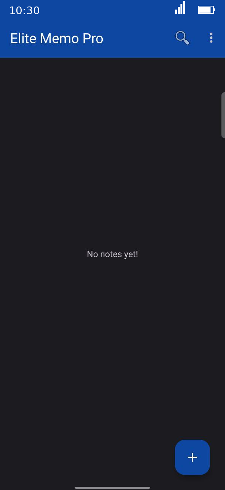

# 📝 Elite Memo Pro

**Elite Memo Pro** is a high-performance, secure, and fully offline Android notepad application. It features a premium dark UI and advanced biometric security to keep your thoughts safe.

---

## ✨ Key Features
* 🔐 **Biometric Lock:** Secure your notes with Fingerprint or PIN.
* ⚡ **Auto-Save:** Never lose a word; every character is saved instantly.
* 🕒 **Timestamps:** Track when each note was created or modified.
* 🔍 **Smart Search:** Find any note quickly with the built-in search bar.
* 🌐 **Offline First:** No internet required, your data stays on your device.

---

## 📸 Screenshots
| Dashboard View | App Settings | Security Lock |
| :---: | :---: | :---: |
|  |  |  |

---

## 🛠 Technical Details
* **Language:** Java / Android SDK
* **Database:** SQLite
* **Architecture:** Robust & Lightweight
* **Privacy:** Zero trackers, zero analytics, 100% private.

---

## 📜 License
This project is licensed under the MIT License - see the [LICENSE](LICENSE) file for details.

**Developed with ❤️ by Deepanjan.**
