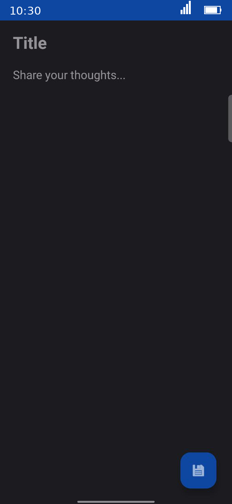
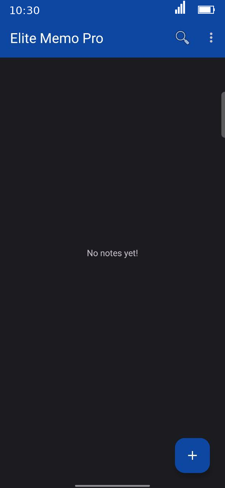
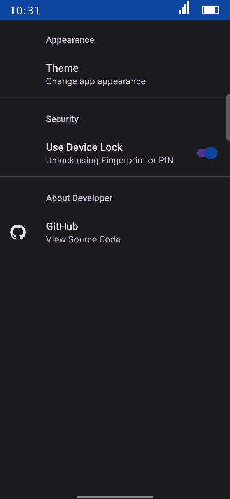

# 📝 Elite Memo Pro

**Elite Memo Pro** is a high-performance, secure, and fully offline Android notepad application. It features a premium dark UI and advanced biometric security to keep your thoughts safe.

---

## ✨ Key Features
* 🔐 **Biometric Lock:** Secure your notes with Fingerprint or PIN.
* ⚡ **Auto-Save:** Never lose a word; every character is saved instantly.
* 🕒 **Timestamps:** Track when each note was created or modified.
* 🔍 **Smart Search:** Find any note quickly with the built-in search bar.
* 🌐 **Offline First:** No internet required, your data stays on your device.

---

## 📸 Screenshots
| Note List View | Dashboard View | App Settings |
| :---: | :---: | :---: |
|  |  |  |

---

## 🛠 Technical Details
* **Language:** Java / Android SDK
* **Database:** SQLite
* **Architecture:** Robust & Lightweight
* **Privacy:** Zero trackers, zero analytics, 100% private.

---

## 🚀 Upcoming Features & Roadmap

These features are planned for upcoming releases:

- [ ] **Kotlin & Material 3 Migration** — Modernizing the codebase & UI
- [ ] **Drawing / Canvas Notes** — Handwritten notes & sketch support
- [ ] **Trash / Bin Section** — Recycle bin for deleted notes
- [ ] **Archive Notes** — Hide notes from the main list
- [ ] **Tags & Categories** — Better note organization
- [ ] **Export Options** — Save notes as TXT, MD, or PDF
- [ ] **Modern Settings Page** — Theme & security controls
- [ ] **Encrypted Backup & Restore** — Local data export/import

---

## 📜 License
This project is licensed under the MIT License - see the [LICENSE](LICENSE) file for details.

**Developed with ❤️ by Deepanjan.**
