<p align="center">
  
</p>

<h1 align="center">Elite Memo Pro</h1>

<p align="center">
  <em>A local-first Android notes app — text, checklists, and freehand drawing — built with Kotlin and Jetpack Compose.</em>
</p>

<p align="center">
  <a href="LICENSE"></a>
  
  
  
  
</p>

---

Elite Memo Pro is a notes app for Android that keeps **text notes and freehand drawings together in one place**. Write notes with a title and body, add inline checklists, sketch on a canvas with a full set of drawing tools, and keep everything organised with labels, colours, pins, search, reminders, and a built-in archive and trash.

It is **local-first**: notes, labels, and settings live in an on-device Room database and DataStore. No account and no server are needed to use the app.

## Features

**Notes**
- Rich text notes with a title and body.
- Inline checklists with per-item completion state.
- Per-note colour and pinning.

**Drawing**
- Freehand drawing notes with pen, marker, highlighter, selection, and eraser tools.
- Eraser supports both segment and whole-stroke modes.
- Undo and redo for drawing edits.
- Selectable canvas backgrounds: blank, ruled, grid, and dotted guides.
- A colour palette sheet for stroke colours.

**Organise**
- Labels: add, rename, delete, and apply labels to notes.
- Search across note titles, body text, and tags; filter by label or colour.
- Grid and list layouts on the home screen.
- Archive to set notes aside, and Trash with restore, permanent delete, and empty-trash.

**Reminders & security**
- Schedule a reminder per note; when it fires, WorkManager posts a notification that opens the note.
- Light, dark, or system appearance.
- Optional app lock using biometrics or the device credential.

**Extras**
- Counts for active notes, pinned notes, and words in Settings.
- Edge-to-edge Material 3 interface.

## Screenshots

<p align="center">
  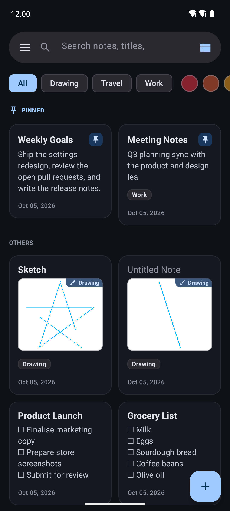
  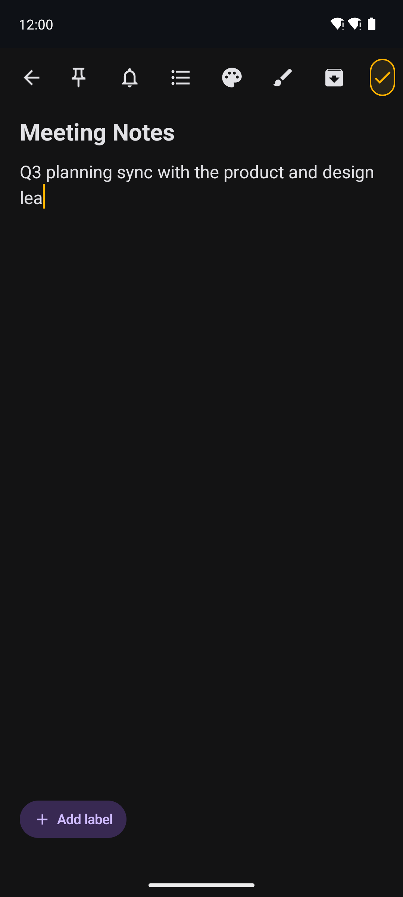
  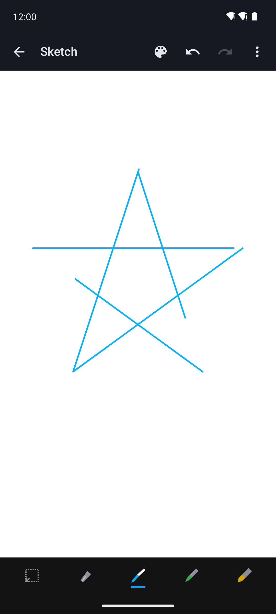
  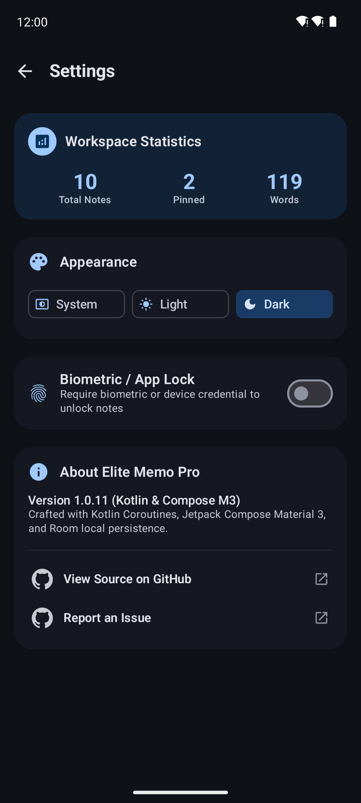
</p>

<details>
<summary>View all screenshots</summary>

| Screen | Preview |
|---|---|
| Home (grid) |  |
| Home (list) | 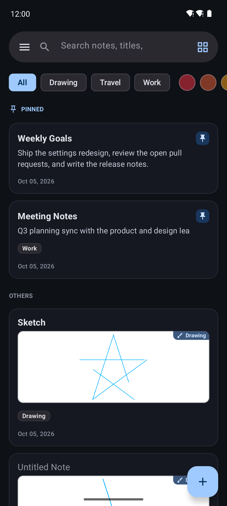 |
| Search results | 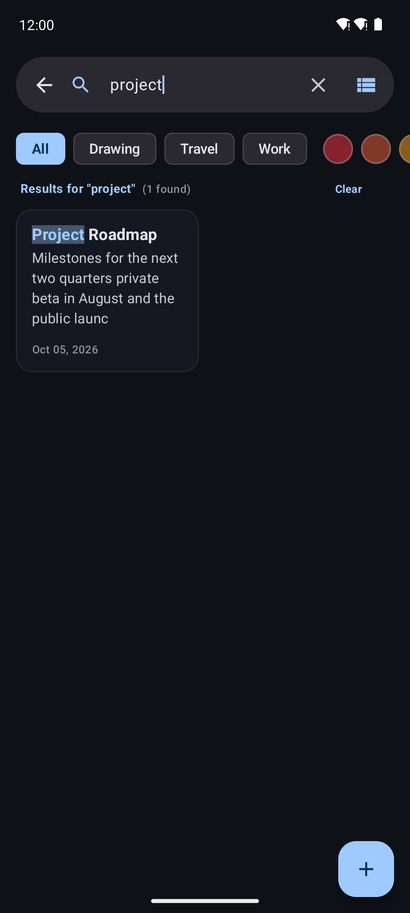 |
| Navigation drawer | 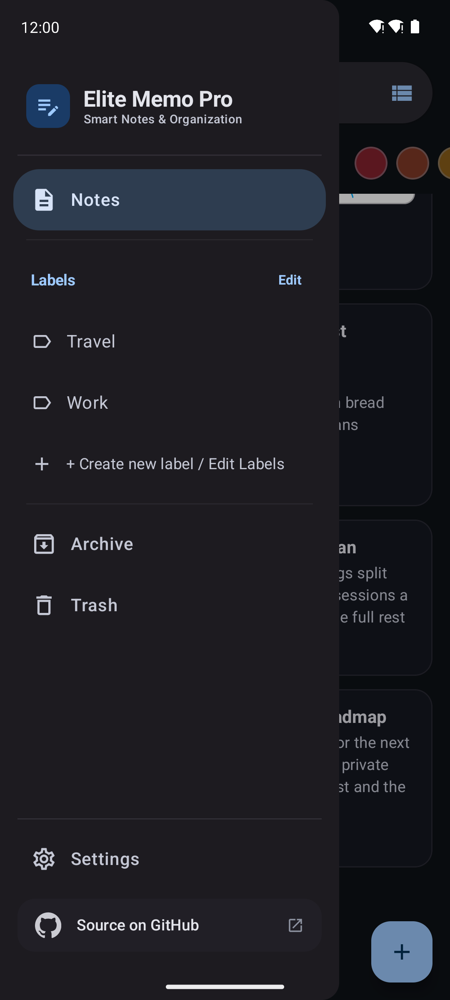 |
| Note editor |  |
| Labels sheet | 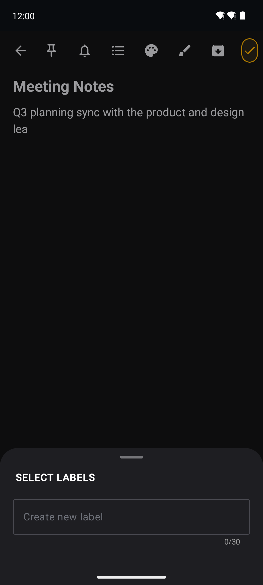 |
| Colour picker | 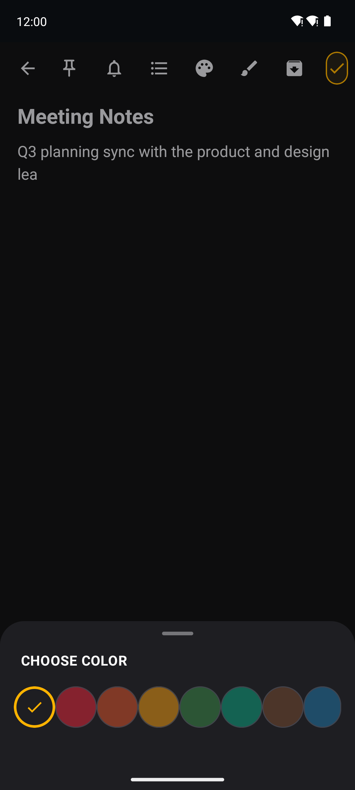 |
| Checklist editor | 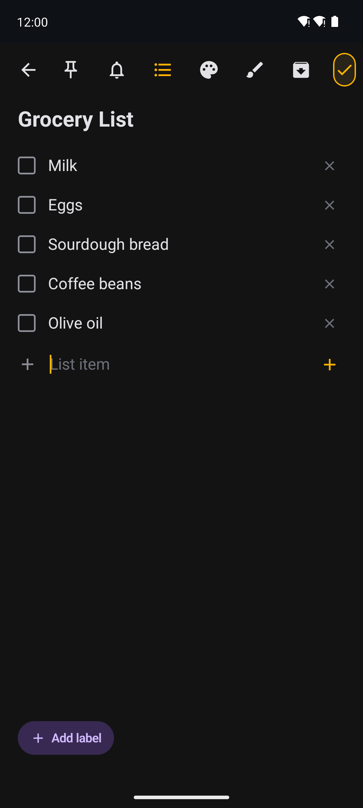 |
| Drawing note |  |
| Archive | 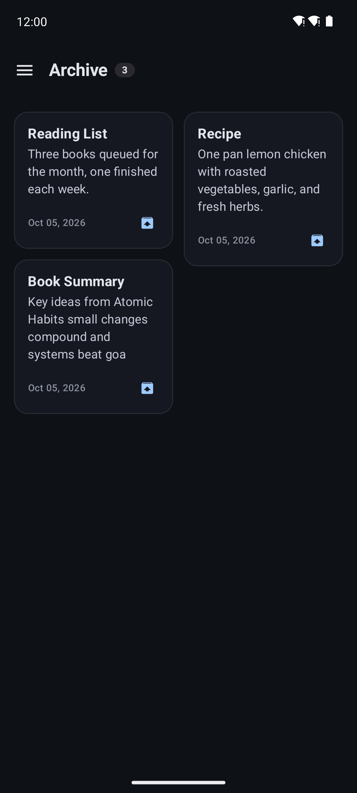 |
| Trash | 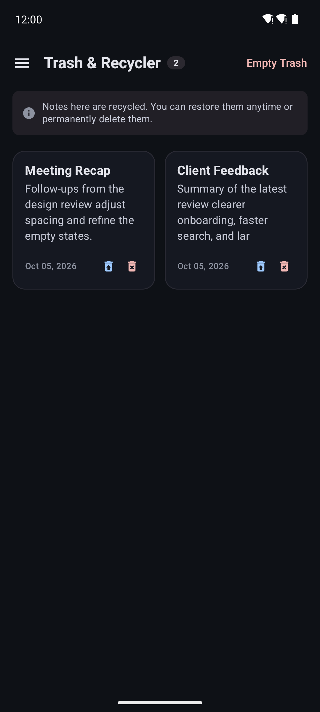 |
| Settings |  |
| Reminder dialog | 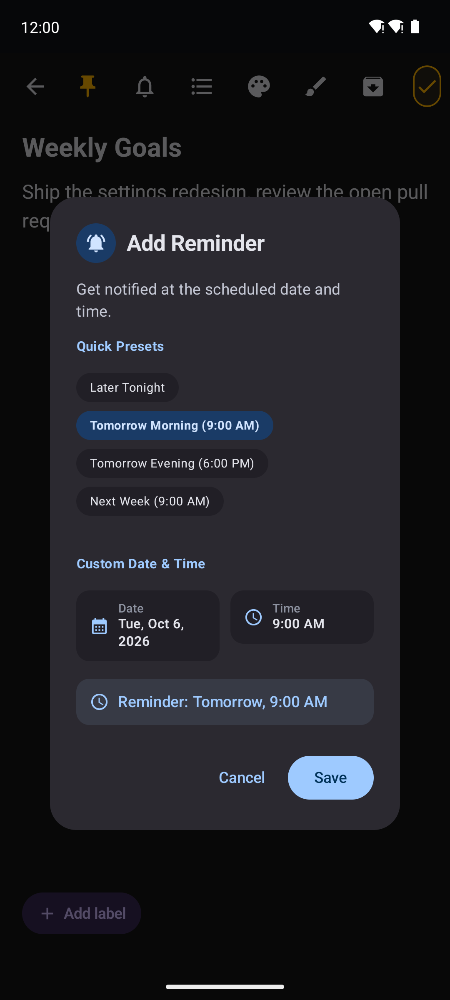 |
| Reminder applied | 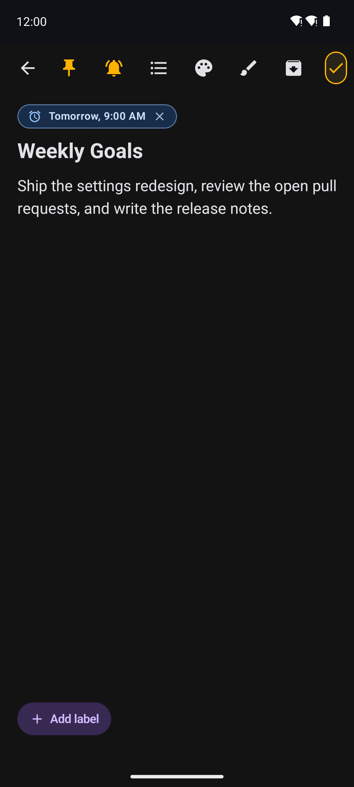 |

</details>

## Tech stack

| Area | Choice |
|---|---|
| Language | Kotlin 2.4.20 |
| UI | Jetpack Compose with Material 3 (Compose BOM `2026.09.00`) |
| Build | Android Gradle Plugin 9.4.1, Gradle 9.8.0, KSP 2.3.12, JDK 21 |
| Local storage | Room 2.8.5 (notes & labels) and DataStore Preferences 1.2.1 (settings) |
| Background work | WorkManager 2.12.0 (note reminders) |
| Security | AndroidX Biometric 1.4.0-alpha07 (optional app lock) |
| Async | Kotlin Coroutines 1.11.0, Flow |
| Remote foundation | Supabase (`auth-kt` / `postgrest-kt` 3.8.0) over Ktor 3.6.0 |
| Testing | JUnit 4.13.2 |

`compileSdk` / `targetSdk` are **37**, `minSdk` is **24**.

## Build & run

### Prerequisites

- **JDK 21** (Temurin recommended).
- **Android SDK** with platform **37** and build-tools **36.0.0**.
- The Gradle wrapper is bundled — no separate Gradle install is needed.

### Build & run

```bash
git clone https://github.com/deepanjanxyz/notepad.git
cd notepad

# Build the debug APK → app/build/outputs/apk/debug/
./gradlew assembleDebug

# Install on a connected device or emulator
./gradlew installDebug

# Run the JVM unit tests for all modules
./gradlew test
```

The domain module is pure Kotlin, so use cases and models are covered by JVM unit tests (`NoteLogicTest`) and run without an emulator.

### Release signing

The app module builds one APK per ABI (`arm64-v8a`, `armeabi-v7a`, `x86`, `x86_64`) plus a universal APK, so a single download still works on any device.

Release builds are signed only when a keystore and its credentials are present. Provide a keystore at `app/keystore.jks` and the following values via `app/.env`, `app/local.properties`, or matching environment variables:

| Key | Purpose |
|---|---|
| `KEYSTORE_PASSWORD` | Keystore password |
| `KEY_ALIAS` | Key alias |
| `KEY_PASSWORD` | Key password |

When signing is not configured, the build prints a warning and produces an **unsigned** release APK, so reproducible / F-Droid-style builds still succeed instead of failing. Debug builds never need signing secrets. Never commit credentials — `app/keystore.jks`, `.env`, and `local.properties` are all git-ignored.

## Contributing

Contributions are welcome.

1. Fork the repository and create a branch off `develop`.
2. Make your change and ensure `./gradlew test` passes.
3. Open a pull request **against `develop`**.

A few conventions:

- Keep the domain module free of Android dependencies.
- Prefer one focused use case per operation in `domain/usecase/`.
- Don't commit keystores, `.env`, or `local.properties`.

## License

Released under the **MIT License**. See [LICENSE](LICENSE).

```
Copyright (c) 2026 Deepanjan Biswas
```

---

<p align="center"><sub>Built with Kotlin and Jetpack Compose.</sub></p>
